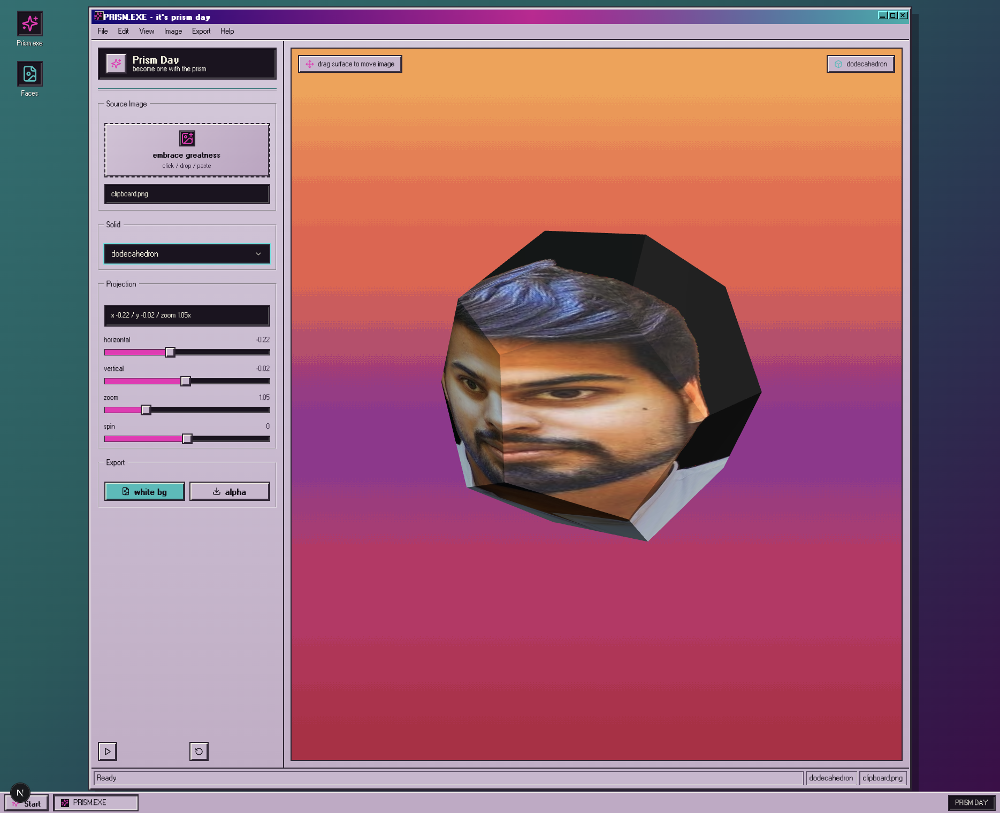

# Prism Day

A Vercel-ready Next.js app for projecting an uploaded portrait onto a pyramid, tetrahedron, cube, sphere, dodecahedron, or distyloid.



## Run

```bash
npm install
npm run dev
```

Open `http://localhost:3000`, upload, drop, or paste an image, then drag the 3D viewport to reposition the projection across the solid.

Inspired by the Obama Prism/Obamium meme.
